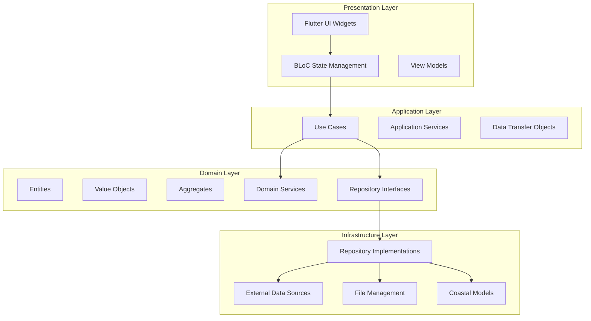
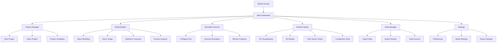

# Coastal Modeling Application - Technical Solution Design Document
## Flutter + Dart Cross-Platform Desktop Application

---

## Table of Contents

1. [Executive Summary](#executive-summary)
2. [System Architecture Overview](#system-architecture-overview)
3. [Technology Stack](#technology-stack)
4. [Domain Model & DDD Structure](#domain-model--ddd-structure)
5. [Application Flow & Navigation](#application-flow--navigation)
6. [Feature Specifications](#feature-specifications)
7. [Component Design](#component-design)
8. [Implementation Roadmap](#implementation-roadmap)
9. [Reference Glossary](#reference-glossary)
10. [Development Guidelines](#development-guidelines)

---

## Executive Summary

### Project Vision
Develop a cross-platform desktop application using Flutter and Dart that demonstrates coastal modeling capabilities, including wave simulation, storm surge prediction, sediment transport analysis, and erosion modeling. The application will serve as both an educational tool and a prototype for more advanced coastal engineering applications.

### Primary Objectives
- **Educational Tool**: Demonstrate coastal processes through interactive simulations
- **Prototype Platform**: Foundation for advanced coastal modeling applications
- **Cross-Platform Support**: Primary focus on macOS and Windows desktop platforms
- **Modular Architecture**: Component-based design following DDD and SOLID principles
- **Real-time Visualization**: Interactive maps and charts for coastal data representation

### Target Users
- Coastal engineering students and professionals
- Environmental scientists and researchers
- Civil engineers working on waterfront projects
- Government agencies involved in coastal management
- Educational institutions teaching coastal processes

---

## System Architecture Overview

### High-Level Architecture Pattern
The application follows a **Clean Architecture** pattern combined with **Domain-Driven Design (DDD)** principles, ensuring separation of concerns and maintainability.



### Core Architectural Principles
1. **Dependency Inversion**: High-level modules don't depend on low-level modules
2. **Single Responsibility**: Each class has one reason to change
3. **Open/Closed**: Open for extension, closed for modification
4. **Interface Segregation**: Clients shouldn't depend on unused interfaces
5. **Domain Independence**: Business logic isolated from infrastructure concerns

---

## Technology Stack

### Core Framework & Language
- **Flutter**: 3.24+ (Desktop support with Windows and macOS)
- **Dart**: 3.5+ (Latest stable version)
- **Desktop Platform**: Flutter Desktop embedding for Windows and macOS

### State Management & Architecture
- **flutter_bloc**: ^8.1.6 - State management using BLoC pattern
- **get_it**: ^7.7.0 - Dependency injection container
- **injectable**: ^2.4.4 - Code generation for dependency injection
- **freezed**: ^2.5.7 - Immutable data classes and unions
- **json_annotation**: ^4.9.0 - JSON serialization support

### Data & Persistence
- **sqflite_common_ffi**: ^2.3.3 - SQLite database for desktop
- **hive**: ^2.2.3 - Local storage for settings and cache
- **shared_preferences**: ^2.3.2 - Simple key-value storage
- **path_provider**: ^2.1.4 - Platform-specific file paths

### Geospatial & Mapping
- **flutter_map**: ^7.0.2 - Interactive map widget
- **latlong2**: ^0.9.1 - Latitude/longitude calculations
- **geolocator**: ^12.0.0 - Location services
- **proj4dart**: ^2.1.0 - Coordinate system transformations

### Mathematical & Scientific Computing
- **vector_math**: ^2.1.4 - Vector and matrix operations
- **collection**: ^1.18.0 - Specialized collections
- **intl**: ^0.19.0 - Internationalization support

### Visualization & Charts
- **fl_chart**: ^0.69.0 - Beautiful charts and graphs
- **syncfusion_flutter_charts**: ^26.2.14 - Advanced charting components
- **flutter_colorpicker**: ^1.1.0 - Color selection widgets

### File I/O & Data Formats
- **csv**: ^6.0.0 - CSV file reading/writing
- **xml**: ^6.5.0 - XML parsing for configuration files
- **file_picker**: ^8.1.2 - File selection dialogs
- **excel**: ^4.0.6 - Excel file support for data import/export

### HTTP & Networking
- **dio**: ^5.7.0 - HTTP client for API calls
- **retrofit**: ^4.4.1 - Type-safe HTTP client generator
- **pretty_dio_logger**: ^1.4.0 - Network request logging

### Utilities & Development
- **logger**: ^2.4.0 - Logging framework
- **equatable**: ^2.0.5 - Value equality for objects
- **dartz**: ^0.10.1 - Functional programming utilities
- **build_runner**: ^2.4.12 - Code generation tool

### Testing Framework
- **flutter_test**: SDK - Unit and widget testing
- **mockito**: ^5.4.4 - Mocking framework
- **bloc_test**: ^9.1.7 - BLoC testing utilities
- **golden_toolkit**: ^0.15.0 - Golden file testing

---

## Domain Model & DDD Structure

### Bounded Contexts

#### 1. Coastal Modeling Context
**Core Domain**: Primary business logic for coastal simulations

**Entities**:
- `CoastalModel`: Represents a complete coastal modeling scenario
- `SimulationRun`: Individual execution of a coastal model
- `ModelConfiguration`: Parameters and settings for simulations

**Value Objects**:
- `Coordinates`: Latitude/longitude pairs with validation
- `WaveParameters`: Height, period, direction values
- `TimeRange`: Start and end times for simulations
- `ElevationData`: Bathymetry and topography information

**Aggregates**:
- `CoastalModelAggregate`: Root entity managing model lifecycle
- `SimulationResultAggregate`: Managing simulation outputs and analysis

#### 2. Geospatial Context
**Supporting Domain**: Geographic data and coordinate systems

**Entities**:
- `GeospatialDataset`: Geographic data collections
- `CoordinateSystem`: Spatial reference systems

**Value Objects**:
- `BoundingBox`: Geographic boundaries
- `MapExtent`: Visible map area definitions
- `SpatialResolution`: Grid spacing and precision

#### 3. Visualization Context
**Supporting Domain**: Data visualization and user interface

**Entities**:
- `ChartConfiguration`: Chart settings and styling
- `MapLayer`: Individual map data layers

**Value Objects**:
- `ChartStyle`: Colors, fonts, and visual properties
- `LayerVisibility`: Layer display settings

### Domain Services

```dart
// Domain Services Interface Examples
abstract class WaveModelingService {
  Future<WaveSimulationResult> simulateWaves(WaveParameters parameters);
  Future<List<WaveDataPoint>> calculateWaveHeight(Coordinates location);
}

abstract class SedimentTransportService {
  Future<SedimentFlowResult> calculateSedimentTransport(
    WaveParameters waves,
    CurrentParameters currents,
    SedimentProperties sediment,
  );
}

abstract class StormSurgeService {
  Future<StormSurgeResult> simulateStormSurge(
    WindField windField,
    BarometricPressure pressure,
    TidalConditions tides,
  );
}
```

### Repository Interfaces

```dart
// Repository Pattern Interfaces
abstract class CoastalModelRepository {
  Future<CoastalModel> findById(String id);
  Future<List<CoastalModel>> findAll();
  Future<void> save(CoastalModel model);
  Future<void> delete(String id);
}

abstract class GeospatialDataRepository {
  Future<List<ElevationPoint>> getBathymetryData(BoundingBox bounds);
  Future<List<WaveDataPoint>> getWaveData(TimeRange timeRange);
  Future<List<TideDataPoint>> getTidalData(Coordinates location);
}

abstract class SimulationResultRepository {
  Future<void> saveResults(SimulationResult result);
  Future<SimulationResult> getResultById(String id);
  Future<List<SimulationResult>> getResultsByModel(String modelId);
}
```

---

## Application Flow & Navigation

### Main Navigation Structure



### User Journey Flow

```mermaid
flowchart LR
    Start([User Opens App]) --> Load[Load Dashboard]
    Load --> Choice{New or Existing?}
    
    Choice -->|New| Create[Create Project]
    Choice -->|Existing| Open[Open Project]
    
    Create --> Template{Use Template?}
    Template -->|Yes| Select[Select Template]
    Template -->|No| Manual[Manual Setup]
    Select --> Configure
    Manual --> Configure[Configure Model]
    
    Open --> Configure
    Configure --> Build[Build Model]
    Build --> Validate{Validation OK?}
    Validate -->|No| Configure
    Validate -->|Yes| Run[Run Simulation]
    
    Run --> Monitor[Monitor Progress]
    Monitor --> Complete{Complete?}
    Complete -->|No| Monitor
    Complete -->|Yes| Results[View Results]
    
    Results --> Analyze[Analyze Data]
    Analyze --> Export{Export Results?}
    Export -->|Yes| Save[Save/Export]
    Export -->|No| Modify{Modify Model?}
    Save --> End([Done])
    Modify -->|Yes| Configure
    Modify -->|No| End
```



---

## Feature Specifications

### 1. Project Management Module

#### 1.1 Project Dashboard
**Purpose**: Central hub for managing coastal modeling projects

**Key Features**:
- Recent projects list with preview thumbnails
- Quick access to templates and examples
- Project statistics and metadata display
- Search and filter functionality

**User Interface Components**:
- Grid/list view toggle for projects
- Project cards with preview images
- Action buttons (Open, Duplicate, Delete, Export)
- Create new project wizard button

**Expected Behavior**:
- Auto-save project state every 5 minutes
- Thumbnail generation for project previews
- Keyboard shortcuts for common actions
- Drag-and-drop project organization

#### 1.2 Project Templates
**Purpose**: Pre-configured project setups for common scenarios

**Available Templates**:
- **Beach Erosion Study**: Basic wave-induced erosion analysis
- **Storm Surge Assessment**: Hurricane impact modeling
- **Harbor Design**: Port and marina wave analysis
- **Coastal Protection**: Breakwater and seawall effectiveness
- **Climate Change Impact**: Sea level rise scenarios

**Template Components**:
- Pre-defined model parameters
- Sample datasets
- Configured visualization settings
- Documentation and tutorials

### 2. Coastal Modeling Engine

#### 2.1 Wave Modeling Module
**Purpose**: Simulate wave propagation and transformation

**Core Algorithms**:
- Linear wave theory calculations
- Wave refraction and diffraction
- Wave breaking criteria
- Shallow water transformations

**Input Parameters**:
- Deep water wave conditions (height, period, direction)
- Bathymetry data (depth contours)
- Coastal geometry (shoreline configuration)
- Bottom friction coefficients

**Output Products**:
- Wave height distribution maps
- Wave direction vector fields
- Wave energy flux calculations
- Breaking wave locations

**Mathematical Models**:
```dart
// Simplified wave height calculation
class LinearWaveTheory {
  static double calculateWaveHeight(
    double deepWaterHeight,
    double depth,
    double wavelength,
  ) {
    double kh = 2 * pi * depth / wavelength;
    double shoalingCoeff = math.sqrt(math.tanh(kh));
    return deepWaterHeight * shoalingCoeff;
  }
}
```

#### 2.2 Storm Surge Module
**Purpose**: Model hurricane-induced water level elevations

**Core Components**:
- Wind stress calculations
- Barometric pressure effects
- Tide-surge interaction
- Coastal geometry influence

**Input Requirements**:
- Hurricane track data (position, intensity, size)
- Atmospheric pressure fields
- Wind velocity fields
- Astronomical tide predictions
- Coastal bathymetry and topography

**Output Products**:
- Maximum surge elevation maps
- Time series of water levels
- Inundation extent polygons
- Wave setup calculations

#### 2.3 Sediment Transport Module
**Purpose**: Analyze sediment movement and morphological changes

**Transport Mechanisms**:
- Suspended sediment transport
- Bedload transport
- Cross-shore transport
- Longshore drift calculations

**Input Parameters**:
- Wave and current fields
- Sediment grain size distribution
- Bed composition and porosity
- Coastal structures and boundaries

**Output Products**:
- Sediment flux vectors
- Erosion and accretion patterns
- Morphological change predictions
- Sediment budget calculations

### 3. Data Management System

#### 3.1 Data Import/Export
**Supported Formats**:
- **Bathymetry**: XYZ, ASCII Grid, GeoTIFF, NetCDF
- **Wave Data**: CSV, NDBC buoy data, WaveWatch III
- **Meteorological**: GRIB2, NetCDF, CSV time series
- **Results**: KML, Shapefile, GeoJSON, CSV

**Import Validation**:
- Data format verification
- Coordinate system detection
- Quality control checks
- Missing data identification

#### 3.2 Data Processing Pipeline
**Preprocessing Steps**:
1. Coordinate system transformation
2. Spatial interpolation and gridding
3. Temporal alignment and resampling
4. Quality control and outlier detection
5. Data smoothing and filtering

**Processing Tools**:
- Kriging interpolation
- Inverse distance weighting
- Temporal averaging
- Spatial filtering

### 4. Visualization Engine

#### 4.1 2D Map Visualization
**Map Components**:
- Base map layers (satellite, topographic, nautical charts)
- Bathymetry contours with color-coding
- Wave height and direction overlays
- Sediment transport vectors
- Coastal structure markers

**Interactive Features**:
- Pan and zoom controls
- Layer visibility toggles
- Point-and-click data queries
- Measurement tools (distance, area)
- Real-time data cursor values

#### 4.2 Chart and Graph System
**Chart Types**:
- Time series plots for wave and water level data
- Scatter plots for correlation analysis
- Histogram distributions for statistical analysis
- Rose diagrams for directional data
- Profile plots for cross-shore transects

**Chart Features**:
- Interactive zooming and panning
- Data export functionality
- Customizable styling and colors
- Multiple y-axis support
- Animation capabilities for time-varying data

#### 4.3 3D Visualization (Future Enhancement)
**3D Components**:
- Bathymetric surface rendering
- Wave surface animations
- Sediment transport visualizations
- Coastal structure 3D models

---

## Component Design

### 1. Core Domain Entities

#### CoastalModel Entity
```dart
@freezed
class CoastalModel with _$CoastalModel {
  const factory CoastalModel({
    required String id,
    required String name,
    required String description,
    required DateTime createdAt,
    required DateTime updatedAt,
    required ModelType type,
    required ModelConfiguration configuration,
    required List<SimulationRun> simulationRuns,
    required GeographicBounds studyArea,
  }) = _CoastalModel;

  factory CoastalModel.fromJson(Map<String, dynamic> json) =>
      _$CoastalModelFromJson(json);
}
```

#### Wave Parameters Value Object
```dart
@freezed
class WaveParameters with _$WaveParameters {
  const factory WaveParameters({
    required double significantHeight, // meters
    required double peakPeriod, // seconds
    required double direction, // degrees from north
    required double spreadingParameter,
    @Default(0.0) double waveSetup,
  }) = _WaveParameters;

  factory WaveParameters.fromJson(Map<String, dynamic> json) =>
      _$WaveParametersFromJson(json);
}
```

### 2. Repository Implementations

#### SQLite-based Coastal Model Repository
```dart
@LazySingleton(as: CoastalModelRepository)
class SqliteCoastalModelRepository implements CoastalModelRepository {
  final Database _database;
  
  const SqliteCoastalModelRepository(this._database);

  @override
  Future<CoastalModel> findById(String id) async {
    final maps = await _database.query(
      'coastal_models',
      where: 'id = ?',
      whereArgs: [id],
    );
    
    if (maps.isEmpty) {
      throw ModelNotFoundException(id);
    }
    
    return CoastalModel.fromJson(maps.first);
  }

  @override
  Future<void> save(CoastalModel model) async {
    await _database.insert(
      'coastal_models',
      model.toJson(),
      conflictAlgorithm: ConflictAlgorithm.replace,
    );
  }
}
```

### 3. Use Case Implementations

#### Create Coastal Model Use Case
```dart
@injectable
class CreateCoastalModelUseCase {
  final CoastalModelRepository _repository;
  final ModelValidationService _validationService;
  
  const CreateCoastalModelUseCase(
    this._repository,
    this._validationService,
  );

  Future<Either<CoastalModelFailure, CoastalModel>> execute(
    CreateCoastalModelParams params,
  ) async {
    try {
      // Validate input parameters
      final validationResult = await _validationService.validate(params);
      if (validationResult.hasErrors) {
        return Left(ValidationFailure(validationResult.errors));
      }

      // Create model entity
      final model = CoastalModel(
        id: generateUniqueId(),
        name: params.name,
        description: params.description,
        createdAt: DateTime.now(),
        updatedAt: DateTime.now(),
        type: params.modelType,
        configuration: params.configuration,
        simulationRuns: [],
        studyArea: params.studyArea,
      );

      // Save to repository
      await _repository.save(model);
      
      return Right(model);
    } catch (e) {
      return Left(UnexpectedFailure(e.toString()));
    }
  }
}
```

### 4. BLoC State Management

#### Coastal Model BLoC
```dart
@injectable
class CoastalModelBloc extends Bloc<CoastalModelEvent, CoastalModelState> {
  final CreateCoastalModelUseCase _createModelUseCase;
  final GetCoastalModelsUseCase _getModelsUseCase;
  final DeleteCoastalModelUseCase _deleteModelUseCase;

  CoastalModelBloc(
    this._createModelUseCase,
    this._getModelsUseCase,
    this._deleteModelUseCase,
  ) : super(const CoastalModelState.initial()) {
    on<CreateModel>(_onCreateModel);
    on<LoadModels>(_onLoadModels);
    on<DeleteModel>(_onDeleteModel);
  }

  Future<void> _onCreateModel(
    CreateModel event,
    Emitter<CoastalModelState> emit,
  ) async {
    emit(const CoastalModelState.loading());
    
    final result = await _createModelUseCase.execute(
      CreateCoastalModelParams(
        name: event.name,
        description: event.description,
        modelType: event.modelType,
        configuration: event.configuration,
        studyArea: event.studyArea,
      ),
    );
    
    result.fold(
      (failure) => emit(CoastalModelState.error(failure.message)),
      (model) => emit(CoastalModelState.created(model)),
    );
  }
}
```

### 5. UI Components

#### Coastal Model Card Widget
```dart
class CoastalModelCard extends StatelessWidget {
  final CoastalModel model;
  final VoidCallback? onTap;
  final VoidCallback? onDelete;
  final VoidCallback? onDuplicate;

  const CoastalModelCard({
    Key? key,
    required this.model,
    this.onTap,
    this.onDelete,
    this.onDuplicate,
  }) : super(key: key);

  @override
  Widget build(BuildContext context) {
    return Card(
      elevation: 4,
      margin: const EdgeInsets.all(8),
      child: InkWell(
        onTap: onTap,
        child: Padding(
          padding: const EdgeInsets.all(16),
          child: Column(
            crossAxisAlignment: CrossAxisAlignment.start,
            children: [
              Row(
                children: [
                  Icon(_getModelTypeIcon(model.type)),
                  const SizedBox(width: 8),
                  Expanded(
                    child: Text(
                      model.name,
                      style: Theme.of(context).textTheme.headlineSmall,
                    ),
                  ),
                  PopupMenuButton<String>(
                    onSelected: _handleMenuSelection,
                    itemBuilder: (context) => [
                      const PopupMenuItem(
                        value: 'duplicate',
                        child: Text('Duplicate'),
                      ),
                      const PopupMenuItem(
                        value: 'delete',
                        child: Text('Delete'),
                      ),
                    ],
                  ),
                ],
              ),
              const SizedBox(height: 8),
              Text(model.description),
              const SizedBox(height: 8),
              Row(
                children: [
                  Icon(Icons.calendar_today, size: 16),
                  const SizedBox(width: 4),
                  Text(_formatDate(model.updatedAt)),
                  const Spacer(),
                  Chip(
                    label: Text(_getModelTypeLabel(model.type)),
                    backgroundColor: _getModelTypeColor(model.type),
                  ),
                ],
              ),
            ],
          ),
        ),
      ),
    );
  }

  void _handleMenuSelection(String value) {
    switch (value) {
      case 'duplicate':
        onDuplicate?.call();
        break;
      case 'delete':
        onDelete?.call();
        break;
    }
  }
}
```

---

## Implementation Roadmap

### Phase 1: Foundation & Core Architecture (Weeks 1-3)
**Deliverables**:
- Project setup with Flutter and dependencies
- Clean Architecture implementation
- Basic domain entities and value objects
- Repository pattern with SQLite implementation
- Dependency injection setup with GetIt
- Basic UI framework and navigation

**Key Components**:
1. **Week 1**: Project structure, dependencies, and basic entity classes
2. **Week 2**: Repository pattern, database schema, and data access layer
3. **Week 3**: Use cases, BLoC state management, and basic UI components

**Copilot Prompts**:
```
1. "Create Flutter project structure following Clean Architecture with domain, 
   application, and infrastructure layers"
2. "Implement CoastalModel entity with Freezed and value objects for coordinates 
   and wave parameters"
3. "Build SQLite repository implementation for CoastalModel with CRUD operations"
4. "Create BLoC pattern setup for coastal model state management"
```

### Phase 2: Data Management & Import System (Weeks 4-6)
**Deliverables**:
- File import/export functionality
- Data validation and processing pipeline
- Coordinate system transformations
- Basic data visualization components

**Key Components**:
1. **Week 4**: File picker integration and CSV/Excel import
2. **Week 5**: Data validation, coordinate transformations, and spatial operations
3. **Week 6**: Basic map widget integration and data layer rendering

**Copilot Prompts**:
```
1. "Implement CSV and Excel file import with data validation for bathymetry data"
2. "Create coordinate system transformation service using proj4dart"
3. "Build flutter_map integration with bathymetry contour layers"
4. "Design data validation service with quality control checks"
```

### Phase 3: Wave Modeling Engine (Weeks 7-9)
**Deliverables**:
- Linear wave theory implementation
- Wave transformation calculations
- Wave height and direction modeling
- Basic wave visualization

**Key Components**:
1. **Week 7**: Linear wave theory algorithms and mathematical functions
2. **Week 8**: Wave transformation service and shoaling calculations
3. **Week 9**: Wave direction vectors and visualization components

**Copilot Prompts**:
```
1. "Implement linear wave theory calculations for wave height transformation"
2. "Create wave shoaling and refraction algorithms for shallow water"
3. "Build wave direction vector visualization on flutter_map"
4. "Design wave parameter input forms with validation"
```

### Phase 4: Storm Surge Modeling (Weeks 10-12)
**Deliverables**:
- Storm surge calculation engine
- Hurricane track input system
- Water level time series generation
- Surge visualization components

**Key Components**:
1. **Week 10**: Storm surge mathematical models and wind stress calculations
2. **Week 11**: Hurricane track data input and processing
3. **Week 12**: Water level visualization and time series charts

**Copilot Prompts**:
```
1. "Implement storm surge calculations with wind stress and pressure effects"
2. "Create hurricane track input interface with map-based track drawing"
3. "Build time series charts for water level data using fl_chart"
4. "Design surge elevation contour visualization on maps"
```

### Phase 5: Sediment Transport & Erosion (Weeks 13-15)
**Deliverables**:
- Sediment transport calculations
- Erosion and accretion modeling
- Morphological change predictions
- Sediment visualization components

**Key Components**:
1. **Week 13**: Sediment transport algorithms and bedload calculations
2. **Week 14**: Erosion modeling and morphological change algorithms
3. **Week 15**: Sediment flux visualization and erosion/accretion maps

**Copilot Prompts**:
```
1. "Implement sediment transport calculations for longshore and cross-shore movement"
2. "Create erosion and accretion algorithms based on wave and current conditions"
3. "Build sediment flux vector visualization with arrow overlays"
4. "Design morphological change visualization with before/after comparisons"
```

### Phase 6: Advanced Visualization & Analysis (Weeks 16-18)
**Deliverables**:
- Advanced charting and plotting capabilities
- Statistical analysis tools
- Comparison and analysis features
- Export and reporting functionality

**Key Components**:
1. **Week 16**: Advanced chart types (rose diagrams, scatter plots, histograms)
2. **Week 17**: Statistical analysis tools and data comparison features
3. **Week 18**: Report generation and data export functionality

**Copilot Prompts**:
```
1. "Create rose diagram widget for directional wave and wind data"
2. "Implement statistical analysis tools for wave and water level data"
3. "Build comparison visualization for multiple simulation scenarios"
4. "Design PDF report generation with charts and maps"
```

### Phase 7: Integration & Polish (Weeks 19-20)
**Deliverables**:
- Complete application integration
- Performance optimization
- User interface polish
- Documentation and tutorials

**Key Components**:
1. **Week 19**: Performance optimization, error handling, and integration testing
2. **Week 20**: UI/UX improvements, documentation, and final testing

**Copilot Prompts**:
```
1. "Optimize application performance for large datasets and complex calculations"
2. "Implement comprehensive error handling and user feedback systems"
3. "Create user tutorials and help documentation"
4. "Polish UI components and improve user experience"
```

---

## Reference Glossary

### Coastal Engineering Terms

**Bathymetry**: The measurement of water depth and the study of underwater topography. In coastal modeling, bathymetry data defines the shape of the seafloor, which critically affects wave transformation, storm surge propagation, and sediment transport patterns.

**Significant Wave Height (Hs)**: A statistical measure representing the average height of the highest one-third of waves in a sea state. It's the most commonly used parameter for describing wave conditions and is typically what weather services report as "wave height."

**Wave Period**: The time interval between successive wave crests passing a fixed point. Peak period (Tp) represents the period of the most energetic waves in a spectrum, while mean period is the average of all wave periods.

**Storm Surge**: The abnormal rise in seawater level during a storm, primarily caused by wind stress pushing water toward shore and low atmospheric pressure "sucking" water upward. Storm surge is separate from astronomical tides but can combine with them.

**Littoral Drift**: The movement of sediment along a shoreline due to wave action. Waves approaching the shore at an angle create a zigzag pattern of sediment movement, resulting in net longshore transport.

**Wave Refraction**: The bending of wave crests as they enter shallow water, caused by the portion of the wave in deeper water traveling faster than the portion in shallow water. This concentrates wave energy on headlands and reduces it in bays.

**Wave Shoaling**: The increase in wave height that occurs as waves move from deep water into shallow water, caused by the conservation of energy as the wave slows down and steepens.

**Tidal Datum**: A reference level used for measuring tidal heights. Common datums include Mean Sea Level (MSL), Mean High Water (MHW), and Mean Lower Low Water (MLLW).

**Base Flood Elevation (BFE)**: The computed elevation to which floodwater is anticipated to rise during a base flood (1% annual chance flood). Used in floodplain management and building codes.

**Return Period**: The average time interval between events of a given magnitude. A 100-year storm has a 1% chance of occurring in any given year, not that it occurs exactly once every 100 years.

### Software Architecture Terms

**Domain-Driven Design (DDD)**: A software development approach that focuses on modeling software to match the business domain. It emphasizes collaboration between technical and domain experts to create a shared understanding of the problem space.

**Bounded Context**: A central pattern in DDD that defines the boundaries within which a particular domain model is valid. Each bounded context has its own ubiquitous language and model.

**Aggregate**: A cluster of domain objects that can be treated as a single unit. An aggregate has a root entity and maintains consistency boundaries around the objects it contains.

**Repository Pattern**: An abstraction that encapsulates the logic needed to access data sources. It provides a uniform interface to access data regardless of the underlying storage mechanism.

**Value Object**: An immutable object that is distinguished only by the state of its properties. Value objects have no conceptual identity and are often used to represent descriptive attributes of entities.

**Use Case**: A single business operation or user story that represents what a user wants to accomplish. In Clean Architecture, use cases contain application-specific business logic.

**BLoC (Business Logic Component)**: A state management pattern that separates business logic from the user interface. BLoC uses streams to manage state changes reactively.

### Mathematical & Computational Terms

**Linear Wave Theory**: A mathematical theory that describes the behavior of ocean surface waves. It assumes small wave heights relative to wavelength and provides fundamental relationships between wave properties.

**Dispersion Relation**: A mathematical relationship between wave frequency and wavelength. For ocean waves, this relationship depends on water depth and is crucial for wave propagation calculations.

**Finite Difference Method**: A numerical technique for solving differential equations by approximating derivatives with finite differences. Commonly used in coastal modeling for spatial and temporal discretization.

**Grid Resolution**: The spatial spacing between computational points in a numerical model. Higher resolution (smaller spacing) provides more detail but requires more computational resources.

**Interpolation**: Mathematical techniques for estimating values between known data points. Common methods include linear, bilinear, and kriging interpolation for spatial data.

**Time Series Analysis**: Statistical techniques for analyzing data points collected over time. Used in coastal modeling to analyze wave, tide, and meteorological data patterns.

**Spectral Analysis**: Mathematical techniques for analyzing signals in the frequency domain. Used to decompose complex wave conditions into component frequencies and directions.

**Coordinate Reference System (CRS)**: A framework for defining the location of features on the Earth's surface. Includes geographic (lat/lon) and projected coordinate systems with specific datums and projections.

### Data Formats & Standards

**NetCDF (Network Common Data Form)**: A file format designed for storing and sharing scientific data. Commonly used for oceanographic and meteorological datasets with self-describing metadata.

**GeoTIFF**: A file format that embeds georeference information within TIFF files. Widely used for storing georeferenced raster data like bathymetry and digital elevation models.

**Shapefile**: A vector data format for storing geometric location and attribute information. Consists of multiple files including .shp (geometry), .dbf (attributes), and .prj (projection).

**WKT (Well-Known Text)**: A text markup language for representing vector geometry objects and spatial reference systems. Used for coordinate system definitions and geometric data exchange.

**EPSG Codes**: Numeric codes that identify coordinate reference systems. The European Petroleum Survey Group (now OGP) maintains this registry of spatial reference systems.

**GRIB (GRIdded Binary)**: A file format for storing meteorological data. GRIB2 is the current standard for weather model output including wind, pressure, and precipitation data.

---

## Development Guidelines

### Code Organization Standards

#### Directory Structure
```
lib/
├── main.dart
├── app/
│   ├── app.dart
│   ├── routes/
│   └── theme/
├── core/
│   ├── constants/
│   ├── errors/
│   ├── network/
│   └── utils/
├── features/
│   ├── coastal_modeling/
│   │   ├── domain/
│   │   │   ├── entities/
│   │   │   ├── repositories/
│   │   │   └── usecases/
│   │   ├── data/
│   │   │   ├── models/
│   │   │   ├── repositories/
│   │   │   └── datasources/
│   │   └── presentation/
│   │       ├── bloc/
│   │       ├── pages/
│   │       └── widgets/
│   ├── geospatial/
│   └── visualization/
├── shared/
│   ├── domain/
│   ├── data/
│   └── presentation/
└── injection_container.dart
```

#### Naming Conventions
- **Files**: snake_case (e.g., `coastal_model_repository.dart`)
- **Classes**: PascalCase (e.g., `CoastalModelRepository`)
- **Variables/Functions**: camelCase (e.g., `calculateWaveHeight`)
- **Constants**: SCREAMING_SNAKE_CASE (e.g., `DEFAULT_WAVE_PERIOD`)
- **Private members**: underscore prefix (e.g., `_validateInput`)

#### Documentation Standards
```dart
/// Calculates wave height transformation due to shoaling effects.
/// 
/// Uses linear wave theory to determine how waves change height
/// as they propagate from deep water to shallow water.
/// 
/// Parameters:
/// - [deepWaterHeight]: Wave height in deep water (meters)
/// - [depth]: Water depth at calculation point (meters)
/// - [wavelength]: Wave length in current depth (meters)
/// 
/// Returns:
/// The transformed wave height at the specified depth.
/// 
/// Throws:
/// - [ArgumentError] if any parameter is negative
/// - [WaveCalculationException] if calculation fails
/// 
/// Example:
/// ```dart
/// final shoaledHeight = WaveTheory.calculateShoaling(2.0, 10.0, 156.0);
/// print('Shoaled wave height: ${shoaledHeight.toStringAsFixed(2)} m');
/// ```
static double calculateShoaling(
  double deepWaterHeight,
  double depth, 
  double wavelength,
) {
  // Implementation details...
}
```

### Testing Strategy

#### Unit Testing
- **Domain Layer**: 100% coverage for entities, value objects, and business logic
- **Application Layer**: Test all use cases with mock dependencies
- **Infrastructure Layer**: Test repository implementations with test databases

#### Widget Testing
- **Individual Widgets**: Test UI components in isolation
- **Page Integration**: Test complete page workflows
- **BLoC Testing**: Verify state changes and event handling

#### Integration Testing
- **API Integration**: Test external data source connections
- **Database Operations**: Verify data persistence and retrieval
- **Cross-Platform**: Test on both macOS and Windows platforms

#### Test Structure Example
```dart
group('WaveHeightCalculation', () {
  late WaveModelingService waveService;
  
  setUp(() {
    waveService = WaveModelingService();
  });
  
  group('Linear Wave Theory', () {
    test('should calculate correct shoaling coefficient', () {
      // Given
      const deepWaterHeight = 2.0;
      const depth = 10.0;
      const wavelength = 156.0;
      
      // When
      final result = waveService.calculateShoaling(
        deepWaterHeight, 
        depth, 
        wavelength,
      );
      
      // Then
      expect(result, closeTo(2.05, 0.01));
    });
    
    test('should throw exception for negative wave height', () {
      // Given
      const negativeHeight = -1.0;
      
      // When & Then
      expect(
        () => waveService.calculateShoaling(negativeHeight, 10.0, 156.0),
        throwsA(isA<ArgumentError>()),
      );
    });
  });
});
```

### Performance Guidelines

#### Memory Management
- Use `const` constructors wherever possible
- Dispose controllers and streams in widget dispose methods
- Implement efficient data pagination for large datasets
- Cache frequently accessed calculations

#### Computational Efficiency
- Use isolates for heavy computational tasks
- Implement progressive loading for large datasets
- Optimize mathematical calculations with appropriate algorithms
- Cache intermediate results where applicable

#### UI Performance
- Minimize widget rebuilds with proper BLoC state management
- Use ListView.builder for large lists
- Implement lazy loading for complex visualizations
- Optimize map rendering with appropriate zoom-level data

### Error Handling Strategy

#### Failure Types
```dart
@freezed
abstract class CoastalModelFailure with _$CoastalModelFailure {
  const factory CoastalModelFailure.validation(String message) = ValidationFailure;
  const factory CoastalModelFailure.notFound(String id) = NotFoundFailure;
  const factory CoastalModelFailure.calculation(String details) = CalculationFailure;
  const factory CoastalModelFailure.storage(String error) = StorageFailure;
  const factory CoastalModelFailure.network(String error) = NetworkFailure;
  const factory CoastalModelFailure.unexpected(String error) = UnexpectedFailure;
}
```

#### Error Presentation
- User-friendly error messages
- Detailed logging for debugging
- Graceful degradation when possible
- Recovery suggestions for common errors

### Accessibility Standards

#### UI Accessibility
- Proper semantics labels for screen readers
- Keyboard navigation support
- High contrast color schemes
- Scalable text and UI elements

#### Data Accessibility
- Color-blind friendly visualizations
- Alternative text descriptions for charts
- Keyboard shortcuts for common actions
- Voice-over support for map interactions

---

*This technical solution design document provides a comprehensive blueprint for implementing a coastal modeling application using Flutter and Dart. The modular, component-based approach ensures that development can proceed incrementally while maintaining architectural integrity and code quality.*

**Next Steps**: Begin with Phase 1 implementation using the provided Copilot prompts to establish the foundational architecture and core domain models.
